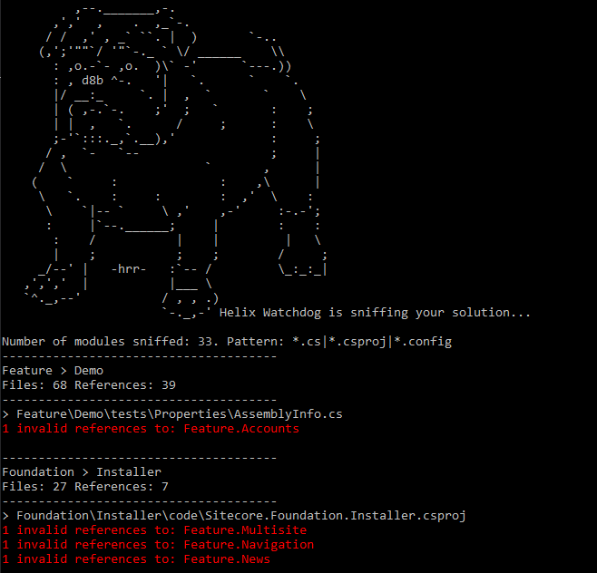

# HelixWatchdog
Command line application that validates Helix references inside the 'src' folder. This tool checks for any kind of reference by checking .cs, .csproj, .config files for strings.

## Usage

    helixWatchdog.exe --source "c:\dev\myproject\src\" --pattern "*.cs|*.csproj|*.config" --namespace "My.Name.Space"

## How does it work

Helix Watchdog searches the specified file types (*.cs, *.csproj, *.config) in the src directory for regex matches following this scheme

    {NamespacePrefix}.(Project|Feature|Foundation|Website).{ModuleName}.

Any match is saved as reference and checked using a set of validators.

### Rules

    Any > Foundation ==> Valid
    Project > Feature ==> Valid
    Website > Any ==> Valid
    
    
Best Practice: To make the most of this validation tool, ensure that settings, pipelines and other configs are prefixed with the full namespace following the Helix scheme. Example:

Bad:

     <setting name="SomeSetting" value="some value" />    

Good:

    <setting name="MyNamespace.Feature.SomeModule.SomeSetting" value="some value" />
    
This way, Helix Watchdog will detect if any other feature is referencing this setting which would be a break of Helix principles.

